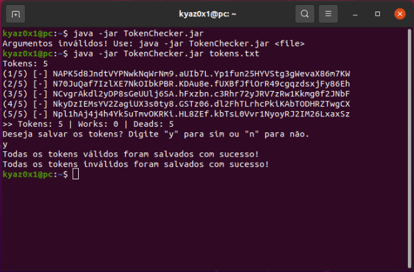

# TokenChecker
Check a list of discord tokens

#### Example usage:
```
java -jar TokenChecker.jar <file>
```

#### Output:


> ⚠️ All tokens checked were for testing purposes and they are all randomly generated, ie don't try to login through them, you won't be able to.

### Project information
|Name| TokenChecker |
|----|--|
|Version|1.0.0|
|Build|b213007|
|Developer|Kyaz0x1|
